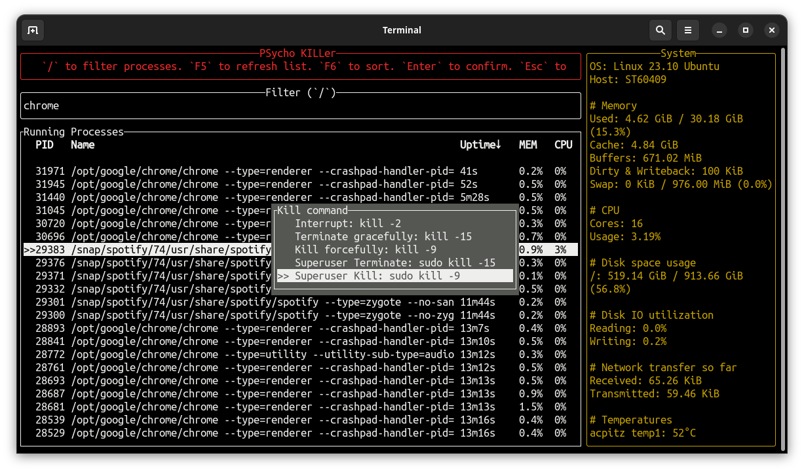

# 😵‍💫 PSycho KILLer

PSycho KILLer is an interactive process manager and system resource monitor that combines the functionalities of `ps` and `kill`.

<div align="center">
    <a href="https://github.com/igrek51/psycho-killer">GitHub</a>
    -
    <a href="https://crates.io/crates/psycho-killer">Crates</a>
    -
    <a href="https://docs.rs/crate/psycho-killer/">docs.rs</a>
</div>



## Features
- "Seek & Destroy" - Quickly find and terminate processes in an interactive manner.
- If a process still remains alive, kill it with sudo privileges and stronger signals.
- Monitor usage of system resources:
  - Memory, including `Dirty` and `Writeback` memory to keep an eye on ongoing copying
  - CPU
  - Disk space usage
  - Disk IO utliziation
  - Network transfer
  - Temperatures

## Installation
### Cargo
```sh
cargo install psycho-killer
```
This will install `psycho` binary in Rust's Path.

### Binary
Alternatively, you can download the compiled binary:

```sh
curl -L https://github.com/igrek51/psycho-killer/releases/download/0.5.2/psycho -o ~/bin/psycho
chmod +x ~/bin/psycho
```

## Usage
Launch the interactive process manager by running `psycho`.

Enter the phrase of a process you want to kill.

Choose the preferred method to terminate the process:

- Interrupt with `SIGINT` signal
- Gracefully terminate the process with `SIGTERM`
- Forcefully kill the process with `SIGKILL` signal
- Terminate the process with `SIGTERM` signal as Superuser
- Forcefully kill the process with `SIGKILL` signal as Superuser
